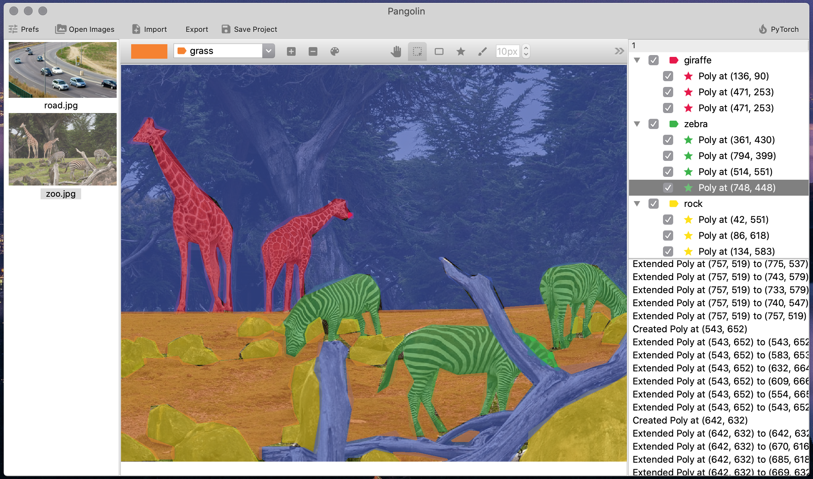
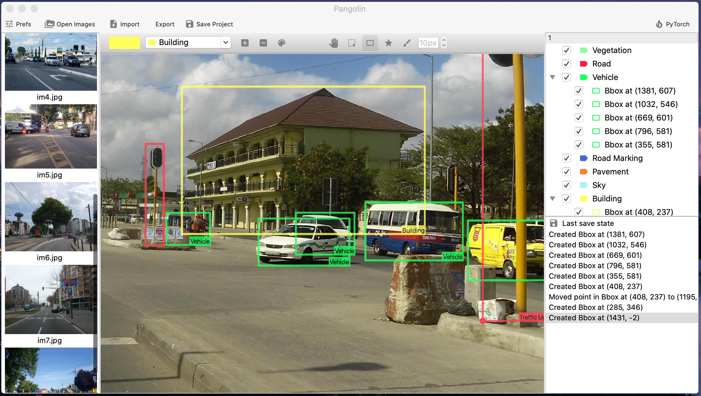
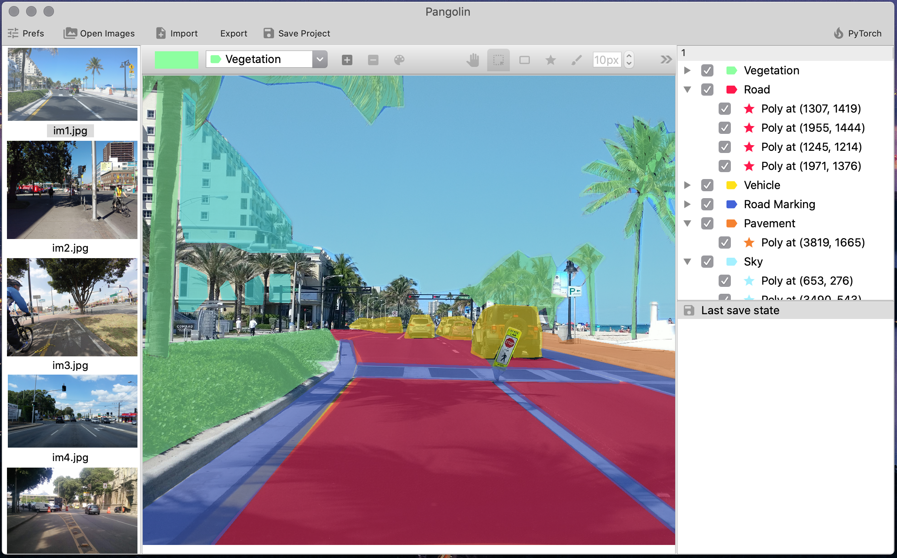
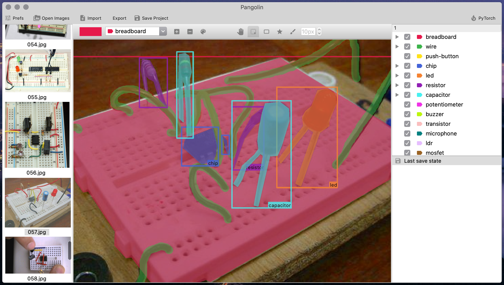
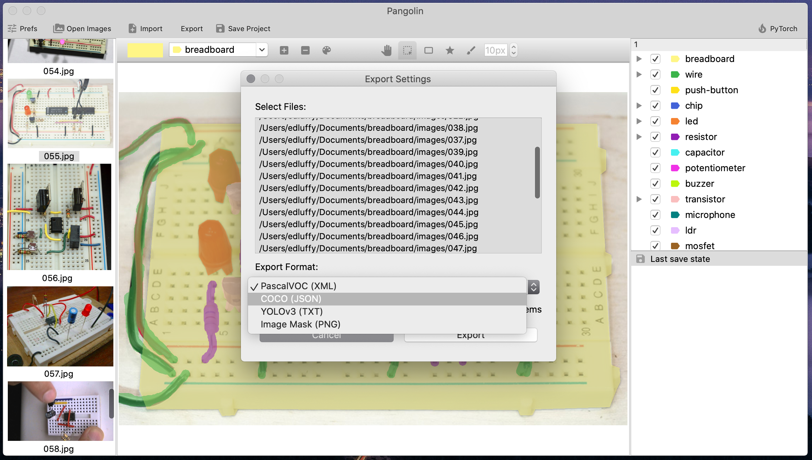

# Pangolin
Pangolin is a graphical image segmentation/annotation tool written in Python using Qt. Created to handle annotation tasks (both object detection and image segmentation) with large datasets of > 700 images.

<p align="center">

</p>

| Image Segmentation ✅ | Object Detection ✅ | Dark mode ✅ |
|---------|---------|---------|
|||

## Features
Support for exporting/importing annotations in different formats:
- [X] PascalVOC (.xml) - obj. detection bounding boxes.
- [X] YoloV3 (.txt) - obj. detection bounding boxes.
- [X] Image (.png) - segmentation mask + obj. detection bounding boxes.
- [ ] COCO (.json) - segmentation mask + obj. detection bounding boxes.

Annotation:
- Smart polygon tool with editable vertices.
- Paint tool with variable point size for direct segmentation of images.
- Bounding box tool with class label.

## Preview
|||
|----|----|
|||

## Installation
#### Linux / macOS
Install [Python3](https://www.python.org/downloads/) and [Git](https://git-scm.com/download/)
```
git clone https://github.com/edluffy/pangolin
cd ~/pangolin
pip3 install -r requirements.txt
python3 app.py
```

#### Windows
Install [Python3](https://www.python.org/downloads/windows/) and [Git](https://git-scm.com/download/win)

Clone the repository and open pangolin directory in command prompt:
```
pip3 install -r requirements.txt
python3 app.py
```

## Usage

## License
