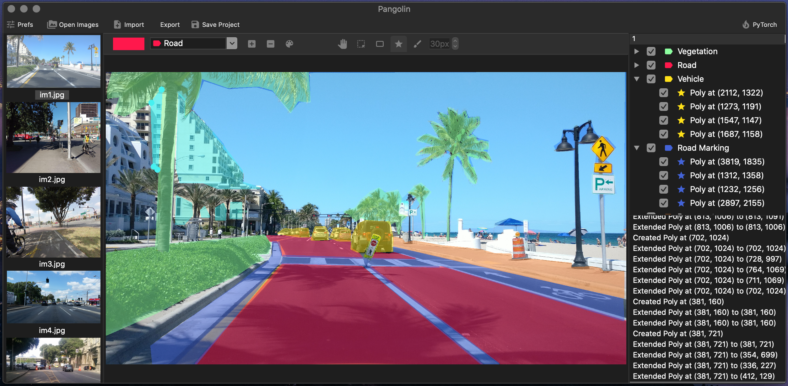

# Pangolin
Pangolin is a graphical image segmentation/annotation tool written in Python using Qt. 
Currently a WIP project.
TODO:
- Move drawing commands into item classes

## Installation

## Usage

## License
